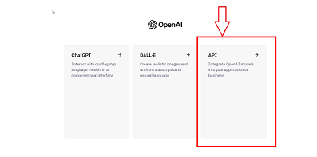
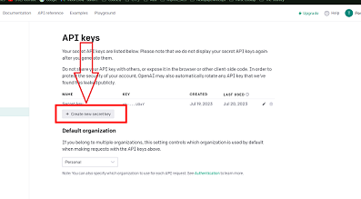

# E.D.I.T.H - Your AI Desktop Assistant

E.D.I.T.H (Even Dead, I'm The Hero) is an advanced AI Desktop Assistant built with Python and powered by OpenAI. This program is designed to improve human-like interactions by providing a conversational experience similar to speaking with a real person. It springs into action when you say "wake up EDI" or "wake up Friday".

## Key Features

1. **Various Modes**: E.D.I.T.H operates in four different modes — `Internet Mode`, `Assistant Mode`, `Hacking Mode`, and `Help Mode`. You can switch between these modes by simply commanding "Friday, go to Internet mode" or "go to Assistant mode", and so forth.

2. **Human-like Interaction**: E.D.I.T.H can chat with you just like a human, enhancing the user experience.

3. **Chat Management**: If you want to clear the conversation, you just have to command 'clear the chat'. To quit or close the program, say 'go to sleep Friday/EDI', which prompts the program to exit.

## Modes Overview

1. **Internet Mode**: Go to your favorite websites just by instructing "Friday, open Google" or "open Facebook."

2. **Assistant Mode**: Open any desktop application with a command like "Friday, open Telegram", "open Zoom", "open Opera".

3. **Hacking Mode**: Stay updated with the upcoming cybersecurity events by asking "Friday, show me the upcoming CTF events."

4. **Help Mode**: You can ask for any help, such as "write me an email," and E.D.I.T.H will get it done for you.

Absolutely, here's how you can modify the "Getting Started" section:

---

## Getting Started

These instructions will guide you on how to set up a copy of E.D.I.T.H on your local machine.

### Prerequisites

Before you begin, ensure you have met the following requirements:

- You have installed Python 3.8 or above. If not, download and install it from [Python's official site](https://www.python.org/downloads/).
- You have installed pip (Python Package Installer), which usually comes with Python.
- You have an API key from OpenAI.

### Installing Dependencies

Follow these steps to set up a development environment:

1. Clone the repository to your local machine using `git clone https://github.com/yourgithubusername/your-repo-name.git`.

2. Navigate into the cloned repository on your machine.

3. Install the necessary packages for this project using pip:

```bash
pip install datetime
pip install sys
pip install time
pip install pywin32
pip install SpeechRecognition
pip install webbrowser
pip install os
pip install requests
```

### Configuration

To get your OpenAI API key:

1. Visit the OpenAI website at https://openai.com and log in to your account.
2. After logging in, click the 'API' section.
3. Click on your account name.
4. Select 'View API keys.'
5. Copy your API key.

Once you have your API key, assign it to the `API_key` variable in the project's configuration.








### Running the Project

To start the application, navigate to the root of the project directory and run:

```bash
python main.py
```

---

## Usage

Here is the small demonstration of this project:

<iframe width="560" height="315" src="https://www.youtube.com/embed/OVl7c7H_bMY" title="YouTube video player" frameborder="0" allow="accelerometer; autoplay; clipboard-write; encrypted-media; gyroscope; picture-in-picture; web-share" allowfullscreen></iframe>

## Contributing

Feel free to upgrade this project .

## License

Copyright (c) 2023 [Ruddra]

## Contact

[My LinkedIn Profile](https://www.linkedin.com/in/i-amruddra/)

[My Facebook Profile](https://www.facebook.com/profile.php?id=100013191316632)

---
