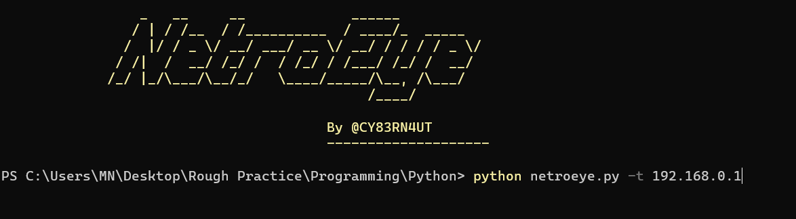

# NetroEye: Network Scanner Project


## Overview

NetroEye is a powerful network scanner tool designed to discover and identify devices connected to a given network. With the ability to identify both live hosts and their MAC addresses, along with vendor information, NetroEye provides valuable insights into the composition of a network. This project is implemented using Python and leverages various modules such as `sys`, `socket`, `mac_vendor_lookup`, `colorama`, `ipaddress`, and most notably, `scapy`.

## Features

1. **Network Scanning**: NetroEye allows users to scan a specific network or interface for live devices. It employs network scanning techniques to determine which hosts are currently active on the network.

2. **MAC Address Identification**: Alongside identifying live hosts, NetroEye also retrieves the MAC addresses of these hosts. This information can be crucial for network diagnostics and security analysis.

3. **Vendor Name Lookup**: NetroEye goes a step further by querying the MAC addresses to retrieve vendor information. This helps in understanding the manufacturer or vendor associated with each device on the network.

4. **User-Friendly Interface**: The project incorporates the `colorama` library to provide a visually appealing and informative user interface. This enhances the user experience by providing real-time updates during the scanning process.

5. **Cross-Platform Compatibility**: NetroEye is designed to be platform-independent. It automatically adapts its behavior based on the operating system. For Windows systems, the tool defaults to the Ethernet IP address, while on Linux systems, it utilizes the loopback IP.

## Prerequisites

To run NetroEye successfully, ensure that you have the following prerequisites installed:

- Python (3.6 or higher)
- Required Python modules: `scapy`, `mac_vendor_lookup`, `colorama`

## Usage

1. Clone the repository to your local machine.

   ```bash
   git clone https://github.com/0xRuddra/Fun-with-Python.git
   ```

2. Navigate to the project directory.

   ```bash
   cd NetroEye
   ```

3. Run the scanner by executing the `netroeye.py` script. You can provide an optional argument for the network or interface you want to scan.

   ```bash
   python netroeye.py -t [network_id or interface]
   ```

   

   If no network information is provided, the tool will default to the appropriate IP address based on your operating system.

4. Sit back and watch as NetroEye performs a comprehensive scan of the network, revealing live hosts, their MAC addresses, and vendor information.

## Video Link

## Contributing

Contributions to NetroEye are welcome and encouraged! If you have any bug fixes, enhancements, or new features to propose, please submit a pull request. Be sure to follow the project's code of conduct and guidelines.

## Contact

Feel free to connect with me on social media:

- LinkedIn: [Your LinkedIn Profile](https://www.linkedin.com/in/i-amruddra/)
- Facebook: [Your Facebook Profile](https://www.facebook.com/profile.php?id=100013191316632)

For any questions or support related to the project, you can also reach out to me via email at your@email.com.

**Happy scanning with NetroEye!** 🕵️‍♀️🌐
